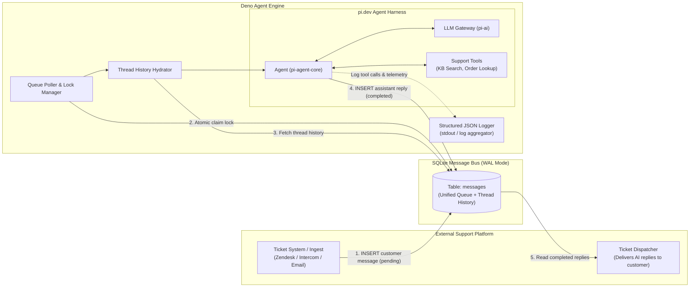
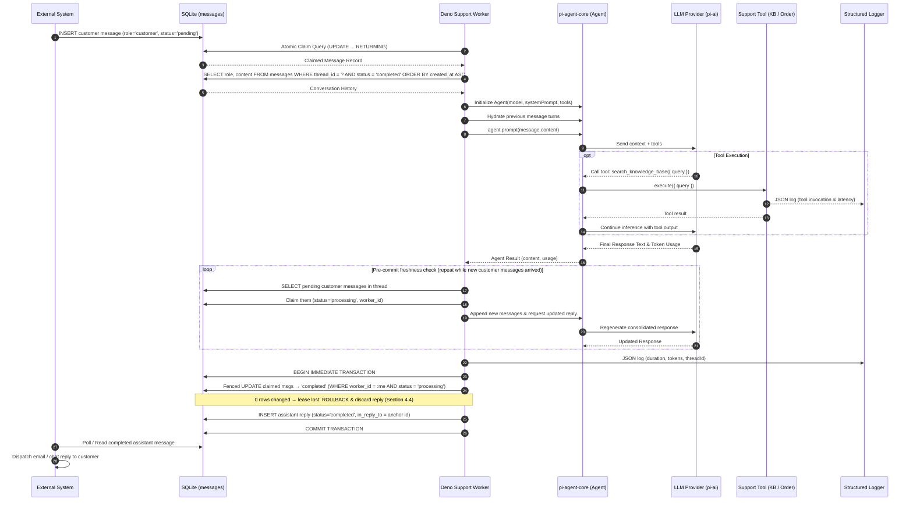

# Customer Support Agent Framework Specification

**Runtime:** Deno 2.x
**Agent Core:** `pi.dev` (`@earendil-works/pi-agent-core`, `@earendil-works/pi-ai`)
**Messaging Backbone & Storage:** SQLite (Single-Table Ledger, WAL mode)
**Observability:** Structured JSON Logging

---

## 1. Executive Overview

This document specifies the technical architecture and implementation details for an asynchronous, decoupled AI customer support agent framework.

The framework uses **SQLite as a reliable transactional messaging broker** between an external ticketing platform (e.g., Zendesk, Intercom, Email router, or custom CRM) and the AI agent processing engine.

Because **ticket lifecycle and status management are handled by the external ticketing platform**, SQLite operates purely as an **AI messaging queue and conversation history buffer**. The entire persistence layer is reduced to a single `messages` table.

Intermediate agent traces, thinking tokens, and tool invocations are emitted directly to **structured log streams** (`stdout`).

**Scope boundary:** The ingestion adapter (webhook/API receiver) and the outbound dispatcher are **out of scope for this codebase** — they are built externally against the `messages` table, which is the sole integration contract (Section 3.2). Because SQLite is an embedded database, those external components must run co-located with the agent engine: same host, same local filesystem (network mounts are unsupported with WAL).

**Non-goals (v1):**
- Token-streamed replies — replies are store-and-forward, delivered as complete messages.
- A human review/draft stage before delivery — `completed` assistant rows are delivered verbatim; `escalate_to_human` is the human-in-the-loop mechanism.
- Multi-tenancy within one database — one database file per business/support inbox; deploy separately per brand.
- History archival or pruning — v1 retains all rows indefinitely.

---

## 2. High-Level System Architecture



---

## 3. SQLite Database Schema

The database consists of a single `messages` table handling queuing, execution leases, conversation history, and outbound delivery.

### 3.1. DDL Schema (`schema.sql`)

```sql
PRAGMA journal_mode = WAL;
PRAGMA synchronous = NORMAL;
PRAGMA busy_timeout = 5000;

CREATE TABLE IF NOT EXISTS messages (
    id TEXT PRIMARY KEY,
    thread_id TEXT NOT NULL,             -- External ticket ID or conversation identifier
    customer_id TEXT,                    -- Stable customer/account ID from the external platform (B2B tenant of the thread)
    role TEXT NOT NULL,                  -- 'customer' | 'assistant' | 'system'
    content TEXT NOT NULL,               -- The message body
    status TEXT NOT NULL,                -- 'pending' | 'processing' | 'completed' | 'failed'
    in_reply_to TEXT,                    -- Assistant rows: id of the anchor customer message this reply answers

    -- Worker Locking & Queue Management
    worker_id TEXT,                      -- Unique worker instance ID claiming the message
    locked_at INTEGER,                   -- Lease timestamp for zombie recovery (Unix ms)
    attempt_count INTEGER DEFAULT 0,         -- Retry counter
    error TEXT,                          -- Error details if failed

    -- Telemetry & Delivery
    model TEXT,                          -- LLM model used (e.g. "claude-3-5-sonnet")
    tokens_in INTEGER,
    tokens_out INTEGER,
    cost_usd REAL,
    metadata JSON,                       -- Customer ID, channel, custom tags from external system; assistant rows may carry {escalated, escalation_reason}
    sent_to_customer_at INTEGER,         -- Delivery timestamp stamped by external dispatcher (on failed customer rows: failure-acknowledged timestamp)

    created_at INTEGER NOT NULL,         -- Unix timestamp (ms)
    completed_at INTEGER                 -- Unix timestamp (ms)
);

-- Index for instant queue polling
CREATE INDEX IF NOT EXISTS idx_messages_queue
ON messages(status, created_at ASC)
WHERE status = 'pending';

-- Index for fast thread history retrieval
CREATE INDEX IF NOT EXISTS idx_messages_thread_history
ON messages(thread_id, created_at ASC);

-- Index for external outbound dispatcher polling
CREATE INDEX IF NOT EXISTS idx_messages_outbound
ON messages(sent_to_customer_at)
WHERE role = 'assistant' AND status = 'completed' AND sent_to_customer_at IS NULL;

-- Duplicate-reply backstop: at most one assistant reply per anchor customer message (Section 4.4)
CREATE UNIQUE INDEX IF NOT EXISTS idx_messages_reply_once
ON messages(in_reply_to)
WHERE role = 'assistant';

-- Index for external platform to detect permanently failed messages (Section 3.2)
CREATE INDEX IF NOT EXISTS idx_messages_failed
ON messages(created_at)
WHERE status = 'failed' AND sent_to_customer_at IS NULL;

-- Per-customer queries: audit today, memory scoping in future phases (Section 10)
CREATE INDEX IF NOT EXISTS idx_messages_customer
ON messages(customer_id, created_at ASC);
```

### 3.2. Table Contract (External Integration Obligations)

The `messages` table is the sole integration surface. External components — built outside this codebase and co-located with the database file — must follow this contract:

**Ingest (external writer):**
1. Insert each customer message as `(id, thread_id, customer_id, role='customer', content, status='pending', metadata, created_at)`, where `id` is the **external platform's own message ID**, `customer_id` is the platform's **stable, verified customer/account identifier** (the B2B tenant — required for tool scoping and future per-customer memory), and `metadata` carries channel and custom tags.
2. Insert with `INSERT OR IGNORE` — at-least-once webhook redelivery then dedupes on the primary key.
3. After receiving an escalated reply for a thread, **stop inserting** further customer messages for that thread until a human hands it back. The engine is deliberately thread-stateless and will answer anything enqueued; muting an escalated thread is the platform's responsibility.

**Dispatch (external reader):**
1. Poll `idx_messages_outbound` for completed assistant rows; deliver `content` to the customer; stamp `sent_to_customer_at`.
2. If the row's `metadata.escalated` is `true`: still deliver the customer-safe `content`, assign a human agent (using `metadata.escalation_reason`), and mute the thread per Ingest rule 3.
3. Poll `idx_messages_failed` for customer messages that exhausted retries; route the thread to a human; stamp `sent_to_customer_at` on the failed row as acknowledgment (on failed customer rows this column means "failure handled", not "delivered"). A permanently failed message must never end in customer silence.

---

## 4. Message Queue & Concurrency Mechanics

### 4.1. Atomic Message Claim Query

To prevent race conditions across multiple Deno workers and ensure that messages within the same `thread_id` are processed sequentially (FIFO):

```sql
UPDATE messages
SET
    status = 'processing',
    worker_id = :worker_id,
    locked_at = :now,
    attempt_count = attempt_count + 1
WHERE id = (
    SELECT id
    FROM messages
    WHERE status = 'pending'
      -- Ensure per-thread serialization: do not claim if another message in the same thread is processing
      AND thread_id NOT IN (
          SELECT thread_id FROM messages WHERE status = 'processing'
      )
    ORDER BY created_at ASC
    LIMIT 1
)
RETURNING *;
```

### 4.2. Crash Recovery & Zombie Lease Reaper

If a worker process crashes or times out while generating a response, the message will remain stuck in `processing`. A background reaper reclaims stale locks:

```sql
UPDATE messages
SET
    status = 'pending',
    worker_id = NULL,
    locked_at = NULL
WHERE status = 'processing'
  AND locked_at < (:now - :lock_timeout_ms) -- LOCK_TIMEOUT_MS, default: 600,000ms (10 minutes)
  AND attempt_count < :max_retries;          -- MAX_RETRIES, default: 3
```

Both knobs are environment-configurable (`LOCK_TIMEOUT_MS`, `MAX_RETRIES`). There is no mid-run lease renewal in v1 (kept deliberately simple), so the lease timeout must be set comfortably above the worst-case agent runtime including tool loops; the fenced completion in Section 4.4 covers the residual race.

Any message exceeding `max_retries` is marked as `status = 'failed'` and an alert is logged. Failed messages additionally surface to the external platform through `idx_messages_failed` (Section 3.2), which routes the thread to a human and acknowledges by stamping `sent_to_customer_at` on the failed row.

### 4.3. Pre-Commit Freshness Check & Reply Coalescing

A reply is generated against a snapshot of the thread, and customers frequently send follow-ups while generation is in flight. To avoid delivering a stale reply that crosses with those follow-ups, the worker re-checks the thread immediately before committing:

```sql
SELECT id, content FROM messages
WHERE thread_id = :thread_id
  AND role = 'customer'
  AND status = 'pending'
ORDER BY created_at ASC;
```

If new messages are found, the worker claims them under its own `worker_id` (same lease fields as Section 4.1 — per-thread serialization guarantees no other worker can take them while the anchor message is `processing`), appends them to the agent conversation, and asks the agent to update its draft so a **single consolidated reply** addresses everything. The check-and-regenerate loop repeats until the pre-commit check comes back empty.

All consumed customer messages are marked `completed` in the same completion transaction, and one assistant reply is inserted with `in_reply_to` set to the anchor (first-claimed) message id. Messages that arrive after the final check are simply picked up as a fresh cycle and answered separately.

### 4.4. Fenced Completion (At-Most-One Delivered Reply)

An agent run may outlive its lease: the reaper resets the anchor message to `pending` and another worker reprocesses it while the original worker is still alive and about to insert its reply. Duplicate LLM spend on such retries is accepted; a duplicate reply reaching the customer is not. Two simple protections enforce this:

1. **Ownership fence.** Before inserting the reply, the completion transaction verifies this worker still owns the claim — and checks that no reply already exists for the anchor:

```sql
BEGIN IMMEDIATE;

UPDATE messages
SET status = 'completed', completed_at = :now
WHERE id IN (:anchor_id, :coalesced_ids)
  AND worker_id = :worker_id
  AND status = 'processing';

-- If changes() < number of claimed messages, the lease was reaped and reassigned:
-- ROLLBACK, discard the generated reply, log `reply_discarded_lost_lease`,
-- and release any still-owned coalesced claims back to 'pending' (guarded by worker_id).

INSERT INTO messages (id, thread_id, role, content, status, in_reply_to, ...)
VALUES (:reply_id, :thread_id, 'assistant', :content, 'completed', :anchor_id, ...);

COMMIT;
```

2. **Database backstop.** `idx_messages_reply_once` (`UNIQUE` on `in_reply_to` for assistant rows) makes the database itself reject a second reply to the same anchor message even if a race slips past the fence — the losing `INSERT` fails and its transaction rolls back.

---

## 5. `pi.dev` Integration Layer

The agent logic leverages `pi.dev` packages:
- `@earendil-works/pi-ai`: Multi-provider LLM gateway (Anthropic, OpenAI, Gemini, Ollama, OpenRouter).
- `@earendil-works/pi-agent-core`: Minimalist agent loop, prompt dispatching, conversation state tracking, and tool execution.

### 5.1. Hydration & Execution Flow



---

## 6. Support Tools Specification

Tools are modular Deno functions adhering to the `pi-agent-core` interface. Tool calls and execution traces are emitted to structured logs.

```typescript
export interface SupportTool<T = any> {
  name: string;
  description: string;
  parameters: Record<string, unknown>; // JSON Schema
  execute: (args: T, context: ToolContext) => Promise<unknown>;
}

export interface ToolContext {
  threadId: string;
  metadata?: Record<string, unknown>;
  signal: AbortSignal;
}
```

### 6.1. Core Support Tools

1. **`search_knowledge_base`**: Searches internal help articles, FAQ entries, and policy documentation.
2. **`lookup_order`**: Fetches order tracking, fulfillment status, and items by order ID.
3. **`lookup_customer_account`**: Retrieves customer account status, billing tier, and recent activity from the external CRM.
4. **`escalate_to_human`**: Flags the reply as an escalation. The final assistant row carries customer-safe text in `content` (e.g. "I'm connecting you with a specialist") and `metadata.escalated = true` plus `metadata.escalation_reason`; internal routing details never go into `content`. Acting on the flag — assigning a human and muting the thread — is the external platform's contractual job (Section 3.2).

**Authorization rule:** `lookup_order` and `lookup_customer_account` must scope every lookup to the verified `customer_id` propagated from the message row into the agent run (and into `ToolContext`). IDs appearing in customer-authored text are untrusted input — honoring them unscoped would let a prompt-injected message read another customer's data.

---

## 7. Structured Logging & Observability

All operational traces, tool calls, and LLM telemetry are formatted as single-line JSON strings to `stdout`.

The same lines also persist to **size-rotated log files** via `@std/log`'s `RotatingFileHandler`: each process writes its own file under `LOG_DIR` (default `./data/logs/`) — `engine.log` for the agent engine, `dev-ui.log` for the dev harness — rotated at `LOG_MAX_BYTES` (default 5 MB) with `LOG_BACKUP_COUNT` numbered backups (default 3). Per-process files keep rotation single-writer. Every event carries its `threadId` as a structured field, so **per-thread log views are a filter, not separate files** — the dev harness's Logs view reads the files and filters by source, minimum level, thread, and text.

### 7.1. Log Event Schemas

#### Tool Execution Log:
```json
{
  "timestamp": "2026-08-26T19:55:00.123Z",
  "level": "info",
  "event": "tool_executed",
  "threadId": "tkt_987",
  "messageId": "msg_001",
  "workerId": "worker-a1b2",
  "toolName": "search_knowledge_base",
  "args": { "query": "return shipping window" },
  "durationMs": 45,
  "resultCount": 2
}
```

#### Message Completion Log:
```json
{
  "timestamp": "2026-08-26T19:55:03.450Z",
  "level": "info",
  "event": "message_completed",
  "threadId": "tkt_987",
  "messageId": "msg_001",
  "responseId": "msg_002",
  "workerId": "worker-a1b2",
  "model": "claude-3-5-sonnet-20241022",
  "tokensIn": 1240,
  "tokensOut": 182,
  "totalDurationMs": 3327
}
```

---

## 8. Directory Layout & Module Structure

```text
flywheel/
├── deno.json                   # Deno configuration, tasks, and imports
├── deno.lock                   # Lockfile
├── schema.sql                  # Single-table SQLite DDL schema
├── specification.md            # System specification (this document)
├── milestones.md               # Delivery plan with per-milestone user verification
├── src/
│   ├── config.ts               # Environment configuration (DB path, API keys, concurrency, LOCK_TIMEOUT_MS, MAX_RETRIES)
│   ├── db/
│   │   ├── client.ts           # SQLite connection & PRAGMA configuration
│   │   ├── queue.ts            # Atomic claim, lease renewal, and zombie recovery
│   │   └── messages.ts         # Message data access layer
│   ├── agent/
│   │   ├── harness.ts          # pi.dev Agent lifecycle manager
│   │   ├── hydrator.ts         # Conversation history mapping
│   │   ├── prompt.ts           # System prompt templates
│   │   └── tools/              # Tool implementations
│   │       ├── index.ts        # Tool registry
│   │       ├── knowledge_base.ts
│   │       ├── orders.ts
│   │       └── escalation.ts
│   ├── engine/
│   │   ├── worker.ts           # Queue polling and execution worker loop
│   │   └── reaper.ts           # Stale lock recovery background task
│   ├── logger/
│   │   └── index.ts            # Structured JSON logger
│   └── main.ts                 # Application entrypoint
├── tools/
│   └── ui/                     # Dev harness (never deployed): web UI simulating the external platform
│       ├── server.ts           # Deno.serve JSON API over the message DAL; serves the static page
│       └── index.html          # Single-file vanilla-JS interface (threads, chat view, failed panel)
└── tests/
    ├── queue_test.ts           # Concurrent claim tests
    └── worker_test.ts          # End-to-end ticket flow tests
```

---

## 9. Security, Permissions & Operational Guidelines

### 9.1. Deno Sandbox Permissions

The application runs with explicit, least-privilege Deno permissions:

```bash
deno run \
  --allow-net=api.anthropic.com,api.openai.com \
  --allow-read=./data,./schema.sql \
  --allow-write=./data \
  --allow-env=DATABASE_PATH,ANTHROPIC_API_KEY,OPENAI_API_KEY,LOG_LEVEL,LOCK_TIMEOUT_MS,MAX_RETRIES,WORKER_CONCURRENCY,POLL_INTERVAL_MS,AGENT_MODE,REAPER_INTERVAL_MS,LOG_DIR,LOG_MAX_BYTES,LOG_BACKUP_COUNT \
  src/main.ts
```

(The canonical task lives in `deno.json`; LLM provider hosts/keys join the allowlists in the milestone that wires the real agent. Log files stay under `./data`, so no write scope beyond `./data` is ever needed.)

### 9.2. SQLite Operational Settings

1. **WAL Mode**: Mandatory (`PRAGMA journal_mode = WAL;`) to allow concurrent reads while a worker is writing.
2. **Busy Timeout**: Set to `5000ms` (`PRAGMA busy_timeout = 5000;`) so concurrent transactions wait rather than throwing `SQLITE_BUSY`.
3. **Periodic Maintenance**: Run `PRAGMA wal_checkpoint(TRUNCATE);` or schedule an hourly optimization task during low-traffic periods.

---

## 10. Future Direction: Per-Customer Memory (B2B)

Flywheel serves **B2B support**: a "customer" is a business account, and effective support requires accumulating knowledge about each customer's setup, history, and recurring issues. Memory itself is a later phase, but the architecture reserves for it now:

1. **First-class customer identity.** Every customer message carries the external platform's stable account ID in `customer_id` (Section 3.2), and the engine propagates it end-to-end: ingest → message row → assistant reply row → agent run input → tools → any future memory store. `idx_messages_customer` already supports per-customer queries.
2. **Hard isolation between customers.** All future memory is keyed by `customer_id` and scoped to it on every read and write. The agent's context for a thread may only ever contain that thread's history plus memory belonging to that thread's `customer_id` — nothing cross-customer, ever. This is the same rule the Section 6.1 authorization already applies to tool lookups.
3. **Identity is issued externally.** `customer_id` originates in the external ticketing platform, which is responsible for verifying it. The engine never invents, infers, or accepts one from message text. Messages without a `customer_id` get no memory reads or writes.
4. **Likely shape (non-binding):** a `memories` table keyed by `(customer_id, key)`, maintained by the agent through a dedicated tool and hydrated into the system prompt per run — to be specified in its own milestone.

---

## 11. Summary of Architectural Advantages

- **Ultra-Minimalist Persistence**: A single `messages` table serves as the queue, history store, and outbound buffer.
- **Zero External Broker Dependencies**: Operates entirely on standard SQLite with ACID guarantees.
- **Strict Per-Ticket Serialization**: Guarantees that subsequent customer replies are processed in strict FIFO order without race conditions; rapid-fire follow-ups are folded into one consolidated reply by the pre-commit freshness check (Section 4.3).
- **At-Most-One Delivered Reply**: The fenced completion transaction plus the `UNIQUE(in_reply_to)` backstop guarantee a customer never receives duplicate replies, even when a lease expires mid-run (Section 4.4).
- **Clean Separation of Concerns**: SQLite stores clean conversational state; high-volume traces and tool debugging live in structured logs.
- **Lightweight & Fast**: Powered by Deno's native TypeScript runtime and `pi.dev`'s minimal agent primitives.
